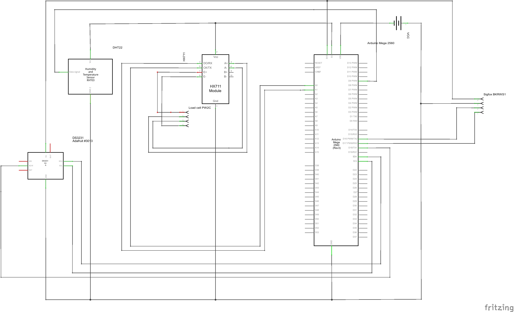

# RucheCO
Ruches connectées avec balance et transmission via réseau SIGFOX

Projet de balances connectées pour le pesage de ruches, transmission des données toutes les 25 min via le réseau Sigfox, 

# Le fonctionnement

Un arduino Mega va lire toutes les 25 min le poids de 6 balances ainsi que la température et l'humidité ambiante. 
Une fois l'acquisition des données OK, les données sont envoyées à un serveur (backend) via le réseau Sigfox.

la partie Backend permet de gérer l'acquisition des données, la gestion des notifications et le rendu utilisateur.

# Fonctionnalités :

Alerte mail lors d'un essaimage.

Alerte mail lors du soulevement d'une ruche (A venir).

Alerte mail lors d'atteinte d'un poids trop faible.

Alerte mail lorsqu'une hausse est pleine.

Alerte miéllée en cours

<b>Les fonctionnalitées de l'interface utilisateur : </b>
indicateurs de progression de miellée sur 7 jours glissants

Graphique poids

Suivi de remplissage des hausses

Prise de note lors des visites avec ajout de photos

Activation ou désactivation des alertes (Essaimage, poids faible...) pour éviter d'être spammé

Exemple de l'interface ici : http://agarde.hd.free.fr/form/index.php?rucheid=1

# Le matériel 

Arduino Mega : microcontrolleur 

DS3231 : Horloge RTC avec fonction d'alarme pour réveil et mise en veille de l'arduino.

HX711 : amplificateur pour les balances

HBM PW2C : capteur de poids

DHT22 : Capteur de temperature

# Schéma Arduino:

# Le backend:
<b>à heberger sur un serveur WEB</b>

<b>Dossier WS : </b> le fichier get.php agit comme webservice pour le callback SigFox

<b>Dossier UI : </b> interface utilisateur 

<b>Dossier BDD : </b> Script SQL pour créer la base de données

